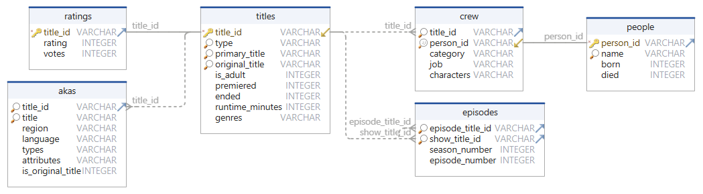

# imdb-sqlite
Imports IMDB TSV files into a SQLite database.

It will fetch the [files][1] from IMDB unless you've already fetched them earlier.

The program relies on the following IMDB tab separated files:

* `title.basics.tsv.gz`: Video titles such as movies, documentaries, tv series, episodes etc.
* `name.basics.tsv.gz`: People in the entertainment business.
* `title.akas.tsv.gz`: Alternative names for titles, for different languages.
* `title.principals.tsv.gz`: Mapping of who participated in which title (movie / show).
* `title.episode.tsv.gz`: Season and episode numbers, for episodes of shows.
* `title.ratings.tsv.gz`: Current rating and vote count for the titles.

## Installation

    pip install imdb-sqlite

## Usage

    usage: imdb-sqlite [OPTIONS]
    
    Imports imdb tsv interface files into a new sqlitedatabase. Fetches them from
    imdb if not present onthe machine.
    
    optional arguments:
      -h, --help       show this help message and exit
      --db FILE        Connection URI for the database to import into (default: imdb.db)
      --cache-dir DIR  Download cache dir where the tsv files from imdb will be stored
                       before the import (default: downloads)
      --no-index       Do not create any indices. Massively slower joins, but cuts the DB
                       file size approximately in half (default: False)
      --verbose        Show database interaction (default: False)

Just run the program with no arguments, and you'll get a file named `imdb.db`
in the current working directory.

### Hints
* Make sure the disk the database is written to has sufficient space.
  About 5 GiB is needed.
* Use a SSD to speed up the import.
* To check the best case import performance, use an in-memory database: 
  `--db :memory:`.

## Example

    $ imdb-sqlite
    
    2018-07-08 16:00:00,000 Populating database: imdb.db
    2018-07-08 16:00:00,001 Applying schema
    
    2018-07-08 16:00:00,005 Importing file: downloads\name.basics.tsv.gz
    2018-07-08 16:00:00,005 Reading number of rows ...
    2018-07-08 16:00:11,521 Inserting rows into table: people
    100%|█████████████████████████| 8699964/8699964 [01:23<00:00, 104387.75 rows/s]
    
    2018-07-08 16:01:34,868 Importing file: downloads\title.basics.tsv.gz
    2018-07-08 16:01:34,868 Reading number of rows ...
    2018-07-08 16:01:41,873 Inserting rows into table: titles
    100%|██████████████████████████| 5110779/5110779 [00:58<00:00, 87686.98 rows/s]
    
    2018-07-08 16:02:40,161 Importing file: downloads\title.akas.tsv.gz
    2018-07-08 16:02:40,161 Reading number of rows ...
    2018-07-08 16:02:44,743 Inserting rows into table: akas
    100%|██████████████████████████| 3625334/3625334 [00:37<00:00, 97412.94 rows/s]
    
    2018-07-08 16:03:21,964 Importing file: downloads\title.principals.tsv.gz
    2018-07-08 16:03:21,964 Reading number of rows ...
    2018-07-08 16:03:55,922 Inserting rows into table: crew
    100%|███████████████████████| 28914893/28914893 [03:45<00:00, 128037.21 rows/s]
    
    2018-07-08 16:07:41,757 Importing file: downloads\title.episode.tsv.gz
    2018-07-08 16:07:41,757 Reading number of rows ...
    2018-07-08 16:07:45,370 Inserting rows into table: episodes
    100%|█████████████████████████| 3449903/3449903 [00:21<00:00, 158265.16 rows/s]
    
    2018-07-08 16:08:07,172 Importing file: downloads\title.ratings.tsv.gz
    2018-07-08 16:08:07,172 Reading number of rows ...
    2018-07-08 16:08:08,029 Inserting rows into table: ratings
    100%|███████████████████████████| 846901/846901 [00:05<00:00, 152421.27 rows/s]
    
    2018-07-08 16:08:13,589 Creating table indices ...
    2018-07-08 16:09:16,451 Import successful


### Note
The import may take a long time, since there are millions of records to
process.

The above example used python 3.6.4 on windows 7, with the working directory
being on a SSD.

## Data model



The IMDB dataset gravitates around the notion of a title. It is the primary
entity. The title ID is what you see in the URL when you visit imdb.com. It is
the defacto ID that other movie and TV sites use to uniquely reference a movie
or show. So a bit of clarification on that ID and how the tables in the dataset
reference it is in order.

A movie has a title, a TV show has one. An episode has one as well. Well two
actually; the title of the show, and the title of the episode itself. That is
why there are two links to the same `title_id` attribute in the `titles` table.

To make the relationships a bit clearer, following are a few query examples

**Find movies named Casablanca and their ratings**
```sql
SELECT t.title_id, t.type, t.primary_title, t.premiered, t.genres, r.rating, r.votes
FROM titles t  INNER JOIN ratings r ON ( r.title_id = t.title_id  )
WHERE t.primary_title = 'Casablanca' AND t.type = 'movie'
```

If the title type is omitted, we'd get results for tv series and other
production types named Casablanca. The current set of title types in IMDB are
the following:

```
{ movie, short, tvEpisode, tvMiniSeries, tvMovie, tvPilot,
  tvSeries, tvShort, tvSpecial, video, videoGame }
```

**Find all episodes of the TV show _Better off Ted_ and rank them by rating**
```sql
-- // table aliases: st = show-title, et = episode-title
SELECT st.primary_title, st.premiered, st.genres, e.season_number,
       e.eposide_number, et.primary_title, r.rating, r.votes
FROM  titles AS st
INNER JOIN       episodes  e ON ( e.show_title_id = st.title_id )
INNER JOIN       titles   et ON ( e.episode_title_id = et.title_id )
LEFT  OUTER JOIN ratings   r ON ( et.title_id = r.title_id )
WHERE st.primary_title = 'Better Off Ted'
AND   st.type = 'tvSeries'
ORDER BY r.rating DESC
```

**Find which productions both Robert Deniro and Al Pacino acted together on**
```sql
SELECT t.title_id, t.type, t.primary_title, t.premiered, t.genres,
       c1.characters AS 'Pacino played', c2.characters AS 'Deniro played'
FROM people p1
INNER JOIN crew   c1 ON ( c1.person_id = p1.person_id )
INNER JOIN titles  t ON ( t.title_id = c1.title_id )
INNER JOIN crew   c2 ON ( c2.title_id = t.title_id )
INNER JOIN people p2 ON ( p2.person_id = c2.person_id )
WHERE p1.name = 'Al Pacino'
AND   p2.name = 'Robert De Niro'
AND   c1.category = 'actor' AND c1.category = c2.category
```

As indicated in the query, each person can participate in a production in
different roles. The crew.category designates the participation role in the
production. The current set of crew categories are:
```
{ actor, actress, archive_footage, archive_sound, cinematographer, composer,
  director, editor, producer, production_designer, self, writer }
```

### Performance tips
Prefix your query with the `EXPLAIN QUERY PLAN`. If you see `SCAN TABLE` in
there, particularly in the beginning, it means the DB is doing a brute-force
search through all the data in the column. This is _very_ slow. You want the
query plan to say `SEARCH` everywhere. If the query shows autoindex rather than
using an explicit index, then that may also be the cause for slow joins. The
tables are very large, which can result in a lot of I/O without explicit
indices. To resolve, create an index for the column indicated as being scanned
or using autoindex and rerun the query plan. Hopefully that results in a
massive query speedup.

For example `sqlite3 imdb.db "CREATE INDEX myindex ON <table-name> (<slow-column>)"`

### Disk space tips
The imported data as of 2023 produces a database file that is about 12 GiB.
About half of that space is for indices used to speed up query lookups and
joins. The default indices take up about as much as the data.

To cater for use cases where people just want to use the tool as part of some
ETL-step, for refreshing the dataset every now and then, and then simply export
the full tables (e.g. for data science using pandas/ML), a `--no-index` flag is
available. When specifying this flag, no indices will be created, which not
only saves about 50% disk space, but also speeds up the overall import process.
When this flag is provided, the DB file will be just shy of 6 GiB as of date of
writing.

If you know precisely which indices you need, omitting the default indices may
also be a good idea, since you'd then not waste disk space on indices you don't
need. Simply create the indices you _do_ need manually, as illustrated in the
performance tip above.

## PyPI
Current status of the project is:
[](https://github.com/jojje/imdb-sqlite/actions/workflows/python-publish.yml)


This project uses an automated build and release process.
The module in the [pypi][2] repository is automatically built and released from
the github source, upon any version tagged commit to the master branch.

Click the status link and check out the logs if you're interested in the
package lineage; meaning how the released pypi module was constructed from
source.

[1]: https://www.imdb.com/interfaces/
[2]: https://pypi.org/project/imdb-sqlite/